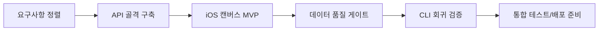

# 개발 과정 및 필요 도구 제안서

작성일: 2026-03-27  
문서 버전: v1.5
프로젝트: SentiVision

## 1. 문서 목적
- PRD(v1.0) 의도에 맞춰 캔버스 기반 감성 분석 앱의 개발 단계를 제안한다.
- 앱/API 개발과 CLI 검증 파이프라인을 함께 운영하는 실행 체계를 정의한다.
- 문서, 개발, 운영 도구를 단계별로 정렬한다.

## 2. 개발 형식 기준
- 문서 구조는 PRD 형식(번호 섹션, FR 요구사항, KPI, 마일스톤, 데이터셋 프로파일)을 기준으로 통일한다.
- 제품 기능은 앱 UX -> API -> 데이터 품질 게이트 순서로 설계한다.
- 현재 CLI는 실험 코드가 아니라 운영 검증 엔진으로 지속 유지한다.

문제 정의 우선 원칙
- 입력 마찰 최소화: 텍스트/음성 입력 강제를 피하고 캔버스 기반 입력 흐름을 우선한다.
- 의도-결과 간극 축소: 결과 카드와 피드백 루프로 사용자의 의도와 예측 차이를 빠르게 교정한다.
- 누적 인사이트 강화: 단발 분석이 아닌 히스토리 기반 비교와 재방문 동기를 구조적으로 포함한다.

## 3. 개발 과정 제안

### 단계 1. 요구사항/아키텍처 정렬
- 작업:
  - PRD, User Journey, WBS, Wireframe 용어 통일
  - 캔버스 입력 모델과 API 계약 정의
- 완료 기준:
  - 앱, API, 데이터 흐름이 문서로 일관되게 연결됨

### 단계 2. 분석 API 골격 구축
- 작업:
  - `POST /analyze`, `POST /feedback`, `GET /health` 설계
  - 요청/응답 스키마 및 검증 규칙 작성
- 완료 기준:
  - 샘플 요청에 대해 예측/피드백 동작 검증 가능

### 단계 3. iOS 캔버스 MVP 개발
- 작업:
  - 캔버스 드로잉 화면 구현
  - 분석 요청, 결과 카드, 피드백 화면 구현
  - 히스토리 기본 화면 구현
- 완료 기준:
  - 드로잉 -> 분석 -> 결과 -> 피드백 흐름이 앱에서 동작

### 단계 4. 데이터 품질 게이트 적용
- 작업:
  - 라벨 정규화(대문자, trim, 오탈자 매핑)
  - 결측/중복 처리 정책 적용
  - 품질 리포트(총 행, 결측, 중복, 고유 라벨) 로그화
- 완료 기준:
  - PRD의 FR-6 요구사항 충족

### 단계 5. CLI 검증 파이프라인 운영
- 작업:
  - `python test/main_.py` 회귀 실행
  - `python test/test_model_comparison.py` 모델 비교 실행
  - 필요 시 `python test/run_all_analysis.py`로 일괄 실행
  - 타임스탬프 기반 시각화 결과 파일 및 CSV 갱신 검증
- 완료 기준:
  - 앱 변경 이후에도 분석 결과 일관성 유지
  - 비교 대시보드에서 모델 성능 차이를 재현 가능

### 단계 6. 통합 테스트/배포 준비
- 작업:
  - API 테스트(pytest)
  - iOS 앱 E2E 시나리오 점검
  - KPI 수집 체계 점검
- 완료 기준:
  - 마일스톤별 품질 게이트 통과

## 4. 필요 도구 제안

### 4-1. 앱 개발
- Xcode 16+
- Swift, SwiftUI
- iOS Simulator, TestFlight

### 4-2. API/백엔드
- Python 3.10+
- FastAPI, Uvicorn
- pydantic, pytest

### 4-3. 분석/데이터
- pandas, numpy, scikit-learn, opencv-python, matplotlib
- CSV 품질 점검 스크립트

### 4-4. 협업/운영
- Git + GitHub
- GitHub Actions (DORA + 테스트 워크플로)
- 이슈 라벨 운영(incident 등)

## 5. 권장 실행 계획
- Phase 1 (1~4주): 아키텍처 설계, API 계약, 문서 정렬
- Phase 2 (5~8주): 분석 API + iOS 캔버스 MVP
- Phase 3 (9~12주): 통합 테스트, 결과 시각화, 피드백 루프
- Phase 4 (13~16주): 성능 최적화, 품질 지표 고도화, 배포 준비

## 6. 시각화: 개발 파이프라인

## 7. 운영 원칙
- 문서와 구현의 불일치를 주 단위로 점검한다.
- 앱 변경 시 API 테스트와 CLI 회귀를 함께 수행한다.
- 데이터셋 변경 시 품질 리포트를 남긴다.
