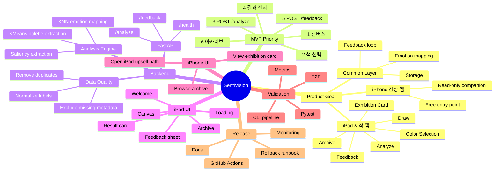

# Implementation Mindmap: SentiVision

작성일: 2026-07-04  
목적: iPad 우선 제품의 구현 범위를 한눈에 보기 위한 실행 구조 정리

## 1. 핵심 마인드맵

## 2. 구현 순서

1. iPad 제작 앱의 캔버스와 색 선택 흐름을 먼저 잡는다.
2. `POST /analyze`를 연결해 분석 결과를 전시 카드 형태로 보여준다.
3. `POST /feedback`와 아카이브 저장을 붙여 한 번의 작업이 누적되게 만든다.
4. `GET /health`, 테스트, 문서, 모니터링을 붙여 운영 가능한 상태로 만든다.
5. 그 다음 iPhone 감상 앱을 무료 companion으로 분리한다.

## 3. 현재 문서와의 관계

- 이 문서는 화면 구조를 정의하는 [Wireframe_SentiVision.md](Wireframe_SentiVision.md)와 함께 본다.
- 실행 순서는 [WBS_to_Codebase_Mapping.md](WBS_to_Codebase_Mapping.md)를 기준으로 맞춘다.
- 더 자세한 화면 흐름은 [ScreenFlow_SentiVision.md](ScreenFlow_SentiVision.md)를 따른다.
