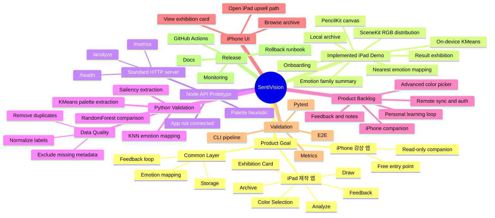

# Implementation Mindmap: SentiVision

작성일: 2026-07-04  
최종 검증일: 2026-09-02
목적: iPad 우선 제품의 구현 범위를 한눈에 보기 위한 실행 구조 정리

## 1. 핵심 마인드맵

```mermaid
mindmap
  root((SentiVision))
    Product Goal
      iPad 제작 앱
        Draw
        Color Selection
        Analyze
        Exhibition Card
        Feedback
        Archive
      iPhone 감상 앱
        Read-only companion
        Free entry point
      Common Layer
        Emotion mapping
        Storage
        Feedback loop
    Implemented iPad Demo
      Onboarding
      PencilKit canvas
      On-device KMeans
      Nearest emotion mapping
      Emotion family summary
      Result exhibition
      Local archive
      SceneKit RGB distribution
    Node API Prototype
      Standard HTTP server
        /health
        /metrics
        /analyze
      Palette heuristic
      App not connected
    Python Validation
      Saliency extraction
      KMeans palette extraction
      KNN emotion mapping
      RandomForest comparison
      Data Quality
        Normalize labels
        Remove duplicates
        Exclude missing metadata
    Product Backlog
      Feedback and notes
      Personal learning loop
      Advanced color picker
      Remote sync and auth
      iPhone companion
    iPhone UI
      Browse archive
      View exhibition card
      Open iPad upsell path
    Validation
      CLI pipeline
      Pytest
      E2E
      Metrics
    Release
      GitHub Actions
      Docs
      Monitoring
      Rollback runbook
```

## 2. 구현 순서

1. **완료**: iPad 온보딩, 캔버스, 로컬 분석, 결과 전시, 3D 분포, 로컬 아카이브를 연결했다.
2. **완료**: 독립 Node API, 테스트, 문서, Docker, 메트릭과 배포 실험 기반을 만들었다.
3. **진행**: 감정 패밀리 대표색과 3D 연결 표현을 비교하며 시각화를 정제한다.
4. **다음**: 피드백·메모와 개인 분포 학습을 완성하고 고급 색상 선택을 추가한다.
5. **후속**: 원격 동기화 계약과 iPhone 감상 앱을 제품 검증 이후 분리한다.

## 3. 현재 문서와의 관계

- 이 문서는 화면 구조를 정의하는 [Wireframe_SentiVision.md](Wireframe_SentiVision.md)와 함께 본다.
- 실행 순서는 [WBS_to_Codebase_Mapping.md](WBS_to_Codebase_Mapping.md)를 기준으로 맞춘다.
- 더 자세한 화면 흐름은 [ScreenFlow_SentiVision.md](ScreenFlow_SentiVision.md)를 따른다.
