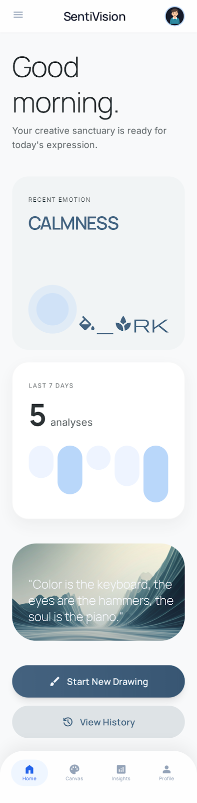

# PRD: SentiVision

작성일: 2026-03-13  
문서 버전: v1.1

## 1. 제품 개요
SentiVision은 사용자가 마음껏 그림을 그리거나 이미지를 올린 뒤, 그 과정에서 사용된 색과 구성을 바탕으로 감정의 결을 해석해주는 프리미엄 감성 컴퓨팅 제품이다.

이 앱의 목적은 감정을 진단하거나 단정하는 것이 아니라, 사용자가 친숙하게 그림을 그리는 경험을 먼저 제공하고 그 결과를 색과 구성으로 다시 바라보게 하는 데 있다.

이 제품은 iPhone보다 iPad에 더 적합한 입력 경험을 기준으로 설계되며, 유료 앱으로 배포되는 것을 전제로 한다.
추가로, 사용자가 그린 작품을 감상만 할 수 있는 iPhone용 동반 앱(companion app)도 확장 방향으로 고려한다.
이 iPhone 동반 앱은 무료로 제공하여 작품 감상 경험을 먼저 열어주고, 그 안에서 iPad 제작 앱으로 자연스럽게 이어지도록 하는 유입 채널 역할을 한다.

### 1.1 홈 화면 시안



## 2. 문제 정의
SentiVision이 해결하려는 핵심 문제는 "사용자가 설명하기 어려운 감정을 그림으로 풀어내고, 그 색을 바탕으로 자연스럽게 해석받을 수 있는 도구가 부족하다"는 점이다.

### 2.1 현황과 배경
- 기존 AI 서비스 다수는 생산성/자동화 중심으로 설계되어, 사용자의 정서 상태를 차분하게 반영하거나 해석하는 기능이 제한적이다.
- 감정 분석 서비스는 주로 텍스트(일기, 댓글)나 음성(톤, 억양) 입력을 요구하며, 사용자가 매번 언어화 또는 발화를 해야 한다.
- 그러나 많은 개인 창작 사용자는 이미 색상 선택과 드로잉을 통해 감정을 표현하고 있어, 별도 입력 전환 없이 감정 해석으로 연결되는 경험이 필요하다.

### 2.2 사용자 문제(Pain Points)
- 감정을 글로 쓰거나 말로 설명하는 과정 자체가 부담이어서 기록을 중단하는 경우가 많다.
- 그림을 그리는 흐름을 끊지 않고 해석까지 이어지는 앱 경험이 부족하다.
- 현재 창작물의 색감이 전달하는 정서 톤을 객관적으로 확인하기 어려워, 의도한 분위기와 결과 사이의 차이를 뒤늦게 인지한다.
- 감정 기록이 단발성으로 끝나 누적 패턴과 변화 흐름을 확인하기 어렵다.

### 2.3 기존 대안의 한계
- 텍스트/음성 기반 분석은 입력 피로가 높고, 창작 흐름을 끊을 수 있다.
- 일반 드로잉 앱은 색상/레이어 편집에는 강하지만, 감정 해석과 아카이브형 기록을 함께 제공하지 않는다.
- 단순 색채 심리 정보는 개인별 맥락 차이를 반영하지 못해, 프리미엄 앱으로서의 만족도를 채우기 어렵다.

### 2.4 왜 지금 해결해야 하는가
- 감정 셀프 트래킹 수요는 증가하고 있지만, 창작 활동과 결합된 저마찰(low-friction) 감정 인터페이스는 아직 부족하다.
- 색상 기반 분석은 언어/문화 장벽 영향을 상대적으로 덜 받아 초기 글로벌 확장 가능성이 있다.
- 사용자 피드백을 수집해 모델을 점진적으로 개선하는 구조를 조기에 설계하면, 제품 정확도와 재방문율을 함께 높일 수 있다.
- iPad 중심의 넓은 입력 공간은 자유로운 드로잉과 프리미엄 경험을 함께 제공하기에 적합하다.
- 유료 앱은 사용자에게 완성도 높은 색상-감정 맵핑, 세련된 인터랙션, 허술하지 않은 화면 품질을 기대하게 만든다.

### 2.5 앱 역할 분리

| 앱 | 역할 | 과금 |
|---|---|---|
| iPad 제작 앱 | 그림을 그리고 감정을 전시하는 핵심 경험 | 유료 |
| iPhone 감상 앱 | 작품과 감정 전시를 감상만 하는 동반 경험 | 무료 |
| 공용 분석/아카이브 | 색상-감정 분석, 피드백, 저장 계층 | 공통 |

## 3. 목표
- 사용자가 부담 없이 그림을 그릴 수 있는 iPad 우선 경험 제공
- 사용자의 그림 색상 팔레트 기반 감정 해석 제공
- 전시형 결과 화면에서 직관적으로 결과를 시각화
- 사용자 피드백 수집으로 모델 정확도와 해석 품질 향상
- 유료 앱에 맞는 프리미엄 디자인과 상호작용 품질 유지
- 향후 iPhone 감상용 동반 앱에서 작품과 감정 전시를 편하게 보는 경험 제공
- 무료 iPhone 감상 앱을 통해 유료 iPad 제작 앱으로 이어지는 자연스러운 전환 경험 제공

## 4. 비목표 (Out of Scope)
- 임상 진단/의료적 판단 제공
- 실시간 멀티유저 협업 드로잉
- 텍스트/음성 멀티모달 감정 분석 (초기 버전 제외)
- 저품질 광고 기반 무료 앱 모델
- 빠른 소비용 소셜 피드 중심 피드백 UX
- iPhone 감상용 동반 앱의 초기 그림 입력 기능
- iPhone 감상 앱에서의 직접 그림 제작 기능

## 5. 타겟 사용자
- 개인 창작 사용자: 감정 셀프 체크와 창작물의 정서 톤 점검을 함께 원하는 사용자
  - iPad나 태블릿형 큰 화면을 선호하며, 그림을 그리는 행위를 즐기는 사용자
  - 프리미엄 앱에 비용을 지불할 의향이 있는 사용자
  - 주요 니즈 1: 빠르게 현재 감정을 시각적으로 확인하고 기록하고 싶다.
  - 주요 니즈 2: 내가 선택한 색 조합이 어떤 감정으로 해석되는지 알고 싶다.
  - 주요 니즈 3: 예측이 내 의도와 다를 때 간단히 정정하고 결과 품질 개선에 기여하고 싶다.
  - 주요 니즈 4: 앱이 허술하지 않고, 결과와 인터랙션이 세련되게 마감되어 있길 원한다.

## 6. 핵심 사용자 시나리오
시나리오명: 오늘의 색으로 감정의 결을 읽는 개인 창작 사용자

1. 앱 진입 및 환영
- 사용자는 차분한 환영 화면에서 오늘의 감정 톤을 탐색한다.
- 시스템은 최근 분석 요약과 아카이브 진입점을 제공해 빠른 맥락을 만든다.

2. 감정/의도 표현 드로잉
- 사용자는 색상 휠, 헥스 코드 직접 입력, 프리셋 팔레트, 스포이트(eyedropper) 등 다양한 방식으로 색상을 선택한다.
- 사용자는 iPad의 넓은 캔버스에서 선, 면, 질감 느낌을 살려 자유롭게 그린다. 색상 수에는 제한이 없다.
- 시스템은 현재 사용 중인 색상과 추출 팔레트를 하단에 실시간 표시해, 사용자가 현재 톤을 즉시 확인할 수 있게 한다.

2-1. 초기 개인화 설정
- 첫 실행 시 사용자는 개인 프로필을 생성하고 기준 색상/기준 감정을 지정한다.
- 설정 메뉴에서 체감 조절 수준, 초기값 복원, 고급 조정을 제공한다.
- 시스템은 이 개인 프로필을 색상-감정 가중치와 결과 해석에 반영한다.

3. 해석 요청
- 사용자가 "분석하기"를 누르면 앱은 그린 이미지를 서버로 전송한다.
- 서버는 현저성 추출 → KMeans 대표 색상 추출 → KNN 감정 매핑 순서로 분석을 수행한다.
- 시스템은 단계형 로딩 메시지(색상 추출 중 → 감정 점수 계산 중)를 보여 대기 불안을 줄인다.

4. 감정 전시
- 시스템은 감정 제목, 해석 문장, 키워드, 대표 색상, 점수 분포를 반환한다.
- 사용자는 결과를 예측값이 아니라 작품 해설처럼 읽고 자신의 감정과 비교한다.
- 각 분석 결과는 하나의 작품 카드로 저장되며, 그림과 감정 제목이 함께 개인 전시 공간에 남는다.

4-1. 개인 분포 반영
- 사용자의 감정 수정과 색상 선택 기록은 개인별 색상-감정 분포도로 축적된다.
- 다음 분석부터는 공통 분포도보다 개인 분포도를 우선 참조하고, 공통 분포도는 보정 기준으로만 사용한다.
- 개인 분포도는 그래프와 데이터 표 형태로 보관되어 사용자가 자신의 기준 변화를 직접 확인할 수 있어야 한다.

5. 피드백 및 기록
- 결과가 의도와 다르면 사용자는 실제 감정을 선택하고, 필요 시 짧은 메모를 입력해 제출한다.
- 시스템은 피드백 저장 완료를 안내하고, 해당 세션을 기록(히스토리)에 반영한다.

6. 아카이브와 자기 인사이트 형성
- 사용자는 아카이브 화면에서 작품 썸네일, 감정 제목, 팔레트, 메모를 다시 본다.
- 각 항목은 그림 1점과 그에 연결된 감정 제목이 짝을 이룬 전시 카드처럼 보인다.
- 사용자는 자신의 감정-색 사용 패턴을 확인하고 다음 창작 기록에 반영한다.

## 7. 기능 요구사항

### FR-1. 드로잉 및 분석 요청
- 앱은 사용자가 그림을 그릴 수 있는 캔버스를 제공해야 한다.
- 분석 요청 시 사용자가 그린 이미지를 서버로 전송해야 한다.

### FR-1-1. 색상 선택 다양화
- 색상 선택기는 다음 입력 방식을 모두 지원해야 한다.
  - 색상 휠(Color Wheel): HSB 기반 자유 선택
  - 헥스 코드 직접 입력: `#RRGGBB` 형식 유효성 검사 포함
  - RGB 슬라이더: R/G/B 채널별 0~255 범위 조절
  - 프리셋 팔레트: 자주 쓰는 색상 저장 및 불러오기 (저장 수 제한 없음)
  - 스포이트(Eyedropper): 캔버스 위 픽셀 색상 추출
- 한 세션에서 사용 가능한 색상 수에는 제한이 없다.
- 사용자가 색상을 선택하면 하단 팔레트 미리보기에 즉시 반영되어야 한다.

### FR-1-2. 초기 개인화 설정
- 첫 실행 시 앱은 개인 프로필을 생성하고 기준 색상/기준 감정을 설정할 수 있게 해야 한다.
- 앱은 개인 프로필을 기반으로 색상-감정 가중치를 조정할 수 있어야 한다.
- 설정 메뉴에는 체감 조절, 초기화, 고급 조정 옵션이 포함되어야 한다.

### FR-2. 감정 분석 API
- 엔드포인트: POST /analyze
- 입력: image(필수), 선택 입력 weights
- 출력: predicted_emotion, confidence_scores, representative_palette
- 잘못된 입력(예: 이미지 누락/손상, 지원하지 않는 파일 포맷, 음수 weight)은 검증 오류를 반환해야 한다.

### FR-3. 피드백 API
- 엔드포인트: POST /feedback
- 입력: predicted_emotion, corrected_emotion, palette, note(선택)
- 결과: 피드백 저장 성공 여부 반환

### FR-4. 결과 시각화
- 앱은 예측 감정과 감정별 점수를 그래프 또는 카드 형태로 표시해야 한다.
- 개인 프로필이 설정된 경우, 결과 카드에는 기준 감정과의 차이 또는 개인 맞춤 해석을 함께 표시할 수 있어야 한다.
- 개인화가 활성화된 경우, 앱은 개인 분포도를 기본으로 보여주고 공통 분포도는 보조 비교 정보로만 사용할 수 있어야 한다.

### FR-5. 감정 분석 파이프라인
감정 분석은 다음 4단계 파이프라인으로 수행된다.

1. **현저성 추출 (Saliency Extraction)**
   - 이미지를 그레이스케일 변환 후 Gaussian Blur를 적용한다.
   - Laplacian 연산으로 경계/변화가 큰 영역(현저 영역)을 saliency map으로 계산한다.
   - 임계값 이진화로 salient mask를 생성하고, mask가 활성화된 픽셀만 이후 단계의 입력으로 사용한다.

2. **대표 색상 추출 (KMeans Clustering)**
   - 현저 영역 픽셀에 KMeans 클러스터링을 적용해 대표 색상(클러스터 중심 RGB)을 추출한다.
   - 사용자가 그린 이미지에서 어떤 색상이든 입력될 수 있으며, 색상 제한은 없다.

3. **최근접 감정 매핑 (KNN Classification)**
   - 보유 데이터셋(RGB-감정 CSV)을 기반으로 KNN 분류기를 학습한다.
   - 추출된 대표 색상 각각을 KNN에 입력해, 데이터셋 내 가장 가까운 색상들의 감정을 다수결로 예측한다.
   - 즉, 사용자가 그린 임의 색상은 데이터셋 중 가장 유사한 색상의 감정으로 매핑된다.

4. **결과 반환**
   - 대표 색상별 예측 감정과 신뢰도 점수를 반환한다.
   - 색상 연관 감정 보정(온기 정보 등)은 선택적으로 반영할 수 있다.

### FR-6. 데이터 정규화 및 품질 게이트
- 서버는 분석 전 데이터셋 로딩 시 라벨 정규화 규칙을 적용해야 한다.
- 정규화 규칙에는 최소한 대소문자 통일, 앞뒤 공백 제거, 오탈자 매핑이 포함되어야 한다.
- `color_name` 또는 `color_label` 결측 레코드는 학습/점수 계산 대상에서 제외하거나 기본 처리 규칙에 따라 분리 관리해야 한다.
- 완전 중복 레코드(동일 emotion/RGB/color_name/color_label)는 1건으로 취급해야 한다.
- 데이터셋 품질 리포트(총 행 수, 결측 수, 중복 수, 고유 감정 수)를 실행 시점에 로그로 남겨야 한다.

## 8. 비기능 요구사항
- 성능: 단일 분석 요청 평균 응답 2초 이내 목표
- 안정성: API health endpoint 제공 (GET /health)
- 보안:
  - 민감정보를 코드에 하드코딩하지 않는다.
  - 환경변수(.env) 기반 설정을 사용한다.
- 컴플라이언스:
  - 데이터셋 재배포 전 라이선스 확인 필수
  - 미확인 데이터는 공개 저장소에 커밋하지 않는다.

## 9. 현재 기술/시스템 범위
- Frontend: Swift/SwiftUI (예정, iPad 제작 앱 우선)
- Companion: iPhone 감상용 전용 앱은 후속 확장 대상
- Backend: FastAPI
- ML/데이터: 색상 기반 매핑 로직 + CSV 데이터셋
- 테스트: pytest 기반 API 테스트

## 10. 성공 지표 (KPI)
- 분석 정확도: 1차 80%+, 목표 85%+
- 사용자 피드백 응답률: 분석 요청 대비 피드백 제출 비율
- API 안정성: /health 성공률 99% 이상 (운영 환경 기준)

## 11. 마일스톤
- M1 (1~4주): 아키텍처 설계, 데이터셋 정리, API 골격 구축
- M2 (5~8주): 핵심 분석 파이프라인 구현, API 연동
- M3 (9~12주): 통합 테스트, 결과 시각화, 피드백 루프 완성
- M4 (13~16주): 성능 최적화, 재학습, 배포 준비

## 12. 데이터셋 프로파일 (color_emotion_labeled_updated.csv)

### 12.1 기본 통계
- 총 레코드 수: 110
- 고유 감정 라벨 수: 82
- `color_name` 또는 `color_label` 결측 레코드 수: 11
- 완전 중복 레코드 수: 4

### 12.2 라벨 분포 (상위)
- LONLINESS: 4
- ENERGY: 4
- TRANQUILITY: 3
- AUTHORITY: 3
- TRUST: 2
- STABILITY: 2

### 12.3 품질 이슈 및 정규화 대상
- 대소문자 혼합: `Depression`, `Loss`
- 오탈자 의심: `CORWARDICE` (의도: `COWARDICE`), `LONLINESS` (의도: `LONELINESS`)
- 결측 메타데이터 행 존재: `color_name`, `color_label` 공란 11건

### 12.4 데이터 처리 정책 (MVP)
- 감정 라벨은 내부 저장 시 대문자로 표준화한다.
- 오탈자/별칭 라벨은 매핑 테이블로 정규화한다.
- 결측 메타데이터 레코드는 분석 학습군에서 제외하고 별도 검수 큐로 보낸다.
- 중복 레코드는 제거 후 집계한다.

### 12.5 원본 샘플 데이터
```csv
emotion,R,G,B,color_name,color_label
INTENSITY,150,36,26,RED,1.0
ENERGY,227,107,35,ORANGE,8.0
HARMONY,29,153,15,GREEN,14.0
TRANQUILITY,132,206,235,SKY BLUE,38.0
CALMNESS,131,211,229,SKY BLUE,59.0
```

### 12.6 현재 검증 기준(보강본)
- 운영 중 CLI 검증과 연구 비교는 `test/color_emotion_labeled_augmented.csv`를 기준으로 한다.
- 연구용 비교 스크립트는 `baseline_laplacian`, `paint_region`, `paint_region_conservative`를 비교한다.
- 제품화 단계에서는 사용자 온보딩에서 감정 단어를 먼저 제시하고, 그에 맞는 색 선택을 통해 개인화 기준을 저장하는 방향을 우선 검토한다.