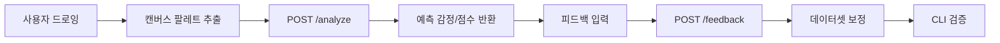

# SentiVision Project Description

작성일: 2026-03-25  
통합 문서 버전: v1.4

## 문서 바로가기
- 개발 과정/도구 제안서: [Development_Process_and_Tools_Proposal.md](Development_Process_and_Tools_Proposal.md)
- PRD: [PRD_SentiVision.md](PRD_SentiVision.md)
- WBS: [WBS_SentiVision.md](WBS_SentiVision.md)
- Wireframe: [Wireframe_SentiVision.md](Wireframe_SentiVision.md)
- User Journey: [User_Journey_Scenario_SentiVision.md](User_Journey_Scenario_SentiVision.md)

---

## 1. 프로젝트 한눈에 보기
SentiVision은 개인 창작 사용자가 캔버스 드로잉의 색감을 통해 감정 톤을 확인하고 기록할 수 있는 iOS 앱을 목표로 한다.  
현재 저장소에는 Python CLI 분석 파이프라인이 구현되어 있으며, 이 파이프라인은 모델 검증과 데이터셋 보정 엔진으로 유지한다.

문제 정의 정렬 요약 (PRD v1.0 기준)
- 핵심 문제: 창작 과정에서 느끼는 감정을 부담 없이 기록하고 해석할 수 있는 도구가 부족하다.
- 사용자 페인포인트: 텍스트/음성 입력 부담, 창작 의도 대비 정서 톤 확인 어려움, 누적 인사이트 부재.
- 제품 방향: 캔버스 색감 입력을 감정 해석으로 바로 연결하는 저마찰 경험과 피드백 기반 품질 루프 제공.

현재 구현 범위 (CLI)
- RGB-감정 CSV 로드 및 KNN 학습
- 현저성 기반 픽셀 추출
- KMeans 주요 색상 3개 추출
- 감정 예측 및 시각화 PNG 3종 생성
- 사용자 피드백 반영을 통한 CSV 갱신
- 모델 비교 스크립트(KNN vs RandomForest) 실행 및 성능 대시보드 생성
- 통합 실행 스크립트로 메인/비교 분석 파이프라인 일괄 실행

목표 구현 범위 (앱/API)
- 캔버스 드로잉 UI
- 분석 API (`POST /analyze`) 연동
- 피드백 API (`POST /feedback`) 연동
- 히스토리/인사이트 화면 제공

---

## 2. 제품 구조

### 2-1. 앱 레이어
- Swift/SwiftUI 기반 캔버스 입력
- 결과 카드/그래프 시각화
- 피드백/기록 UI

### 2-2. API 레이어
- 분석 요청 수신 및 결과 반환
- 피드백 저장 및 품질 루프 반영
- health endpoint 운영

### 2-3. 분석/데이터 레이어 (현행 자산)
- `test/main_.py` 기반 분석 로직 (개선 버전)
- `test/test_model_comparison.py` 기반 모델 성능 비교 로직
- `test/run_all_analysis.py` 기반 일괄 실행 로직
- `test/color_emotion_labeled_updated.csv` 기반 학습/예측
- 시각화 산출물 및 데이터셋 갱신

### 2-4. 베이스라인 (원본 비교용)
- `base_model/` 폴더는 개선 전 원본 파이프라인을 보존한다.
- 개선 결과 비교 및 회귀 검증 시 기준선으로 활용한다.

---

## 3. 실행 및 산출물 (현재 기준)

이 섹션의 내용은 모두 `test/` 폴더 아래 검증용 자산을 기준으로 한다.

실행 파일
- `test/main_.py`
- `test/test_model_comparison.py`
- `test/run_all_analysis.py`

입력 데이터
- `test/color_emotion_labeled_updated.csv`
- `test/colorassociations_warmth - colorwarmth.csv`

실행 명령
```bash
python test/main_.py
```

출력 파일
- `test/outputs/main_YYYYMMDD_HHMMSS_rgb_3d_distribution.png`
- `test/outputs/main_YYYYMMDD_HHMMSS_saliency_maps.png`
- `test/outputs/main_YYYYMMDD_HHMMSS_dominant_color_emotions.png`
- `test/outputs/comparison_YYYYMMDD_HHMMSS_performance_dashboard.png`
- `test/outputs/comparison_YYYYMMDD_HHMMSS_knn_rf_color_pair.png`

---

## 4. 문서 통합 요약
- PRD: 캔버스 기반 창작 사용자 여정, API 요구사항, 데이터 품질 게이트 정의
- User Journey: 앱 사용자 핵심 플로우와 운영 검증 플로우 정의
- WBS: 앱/UI, API, 데이터/CLI를 병렬 트랙으로 분해
- Wireframe: 캔버스 중심 화면 구조와 상호작용 정의
- `test/` 문서: 현재 CLI 검증 절차와 산출물 확인 방법 정의

---

## 5. 시각화: 제품 파이프라인



---

## 6. 운영/컴플라이언스
- 데이터 출처/라이선스 고지는 [test/THIRD_PARTY_NOTICES.md](../test/THIRD_PARTY_NOTICES.md), [test/LICENSES/MIT-sophiwoods-color-associations.txt](../test/LICENSES/MIT-sophiwoods-color-associations.txt) 기준으로 관리
- 저장소 운영 지표는 [README.md](../README.md)의 DORA 워크플로 가이드를 따른다.

---

## 7. 최종 수용 기준
- 문서 전반이 PRD v1.0의 목적(캔버스 창작 사용자 중심)을 일관되게 반영한다.
- 앱/API 계획과 CLI 기반 현재 구현 범위를 함께 명시한다.
- 파일 경로와 산출물 설명이 저장소 구조와 일치한다.
