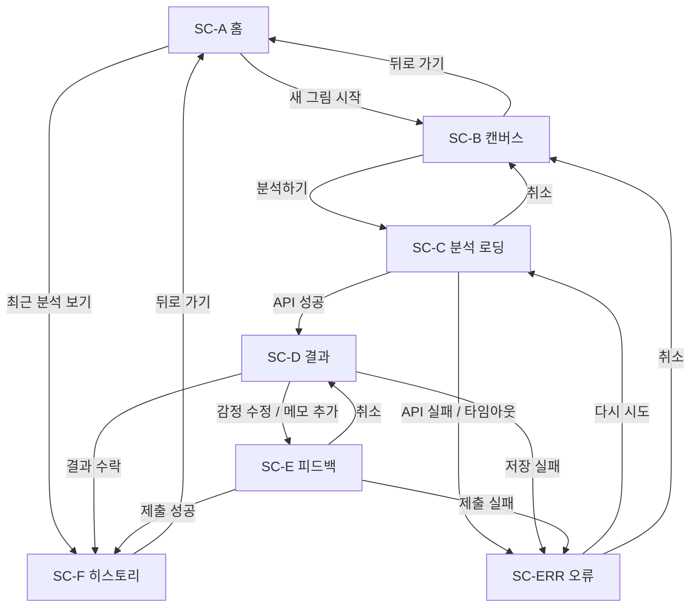
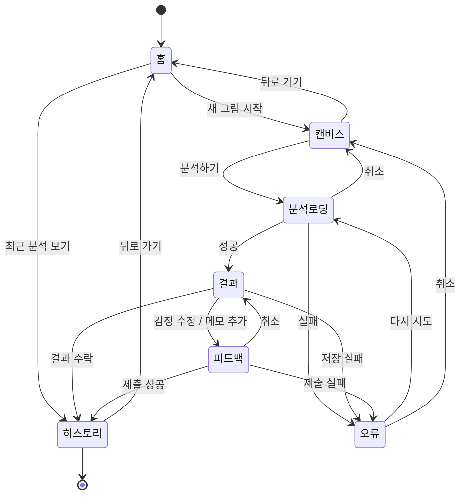

# ScreenFlow: SentiVision (PRD 정렬 버전)

작성일: 2026-04-03  
문서 버전: v1.0

---

## 1. 문서 목적

이 문서는 SentiVision 앱의 각 화면을 기준으로 진입 조건, UI 요소, 사용자 액션, 화면 전환, 예외 처리를 명세한다.  
Wireframe(v1.5)와 User Journey(v1.5)의 내용을 기반으로, 실제 구현 시 화면별 동작 기준점으로 사용한다.

---

## 2. 화면 목록

| 화면 ID | 화면 이름       | 역할                            |
|---------|----------------|---------------------------------|
| SC-A    | 홈              | 진입점 및 최근 분석 요약 제공     |
| SC-B    | 캔버스          | 드로잉 및 팔레트 실시간 확인      |
| SC-C    | 분석 로딩       | API 호출 대기 및 진행 상태 표시   |
| SC-D    | 결과            | 예측 감정·점수 분포·색상 스와치   |
| SC-E    | 피드백          | 감정 수정 및 메모 제출            |
| SC-F    | 히스토리        | 과거 분석 로그 열람               |
| SC-ERR  | 오류 공통 처리  | 네트워크/API/저장 오류 안내       |

---

## 3. 화면별 상세 명세

---

### SC-A. 홈

#### 3.1 진입 조건
- 앱 최초 실행 시
- SC-F(히스토리)에서 뒤로 가기
- SC-E(피드백) 제출 완료 후 홈으로 이동 선택 시

#### 3.2 UI 요소

| 요소              | 유형       | 내용                                  |
|------------------|-----------|---------------------------------------|
| 앱 제목           | 레이블     | `SentiVision`                         |
| 최근 감정 표시     | 레이블     | `최근 감정: {last_emotion}`           |
| 최근 7일 분석 수  | 레이블     | `최근 7일 분석 수: {count}`           |
| 새 그림 시작 버튼 | 주요 버튼  | –                                     |
| 최근 분석 보기 버튼 | 보조 버튼 | –                                     |

- 최초 방문 시 `last_emotion`, `count`는 `–` 로 표시한다.

#### 3.3 화면 전환

| 사용자 액션          | 전환 대상 | 조건        |
|---------------------|-----------|-------------|
| `새 그림 시작` 탭    | SC-B      | 항상        |
| `최근 분석 보기` 탭  | SC-F      | 항상        |

---

### SC-B. 캔버스

#### 3.1 진입 조건
- SC-A에서 `새 그림 시작` 탭

#### 3.2 UI 요소

| 요소                | 유형          | 내용                                         |
|--------------------|--------------|----------------------------------------------|
| 도구 바             | 툴바          | `브러시`, `지우개`, `색상 선택` 버튼          |
| 드로잉 영역         | 캔버스 뷰     | 자유 드로잉 가능, 터치/마우스 입력 지원       |
| 팔레트 미리보기     | 색상 스와치   | 현재 그림에서 추출한 상위 색상 최대 4개 실시간 표시 |
| 분석하기 버튼       | 주요 버튼     | 캔버스 어딘가에 드로잉이 존재할 때 활성화     |

- 캔버스가 비어 있으면 `분석하기` 버튼은 비활성(disabled) 상태로 유지한다.

#### 3.3 화면 전환

| 사용자 액션             | 전환 대상 | 조건                    |
|------------------------|-----------|-------------------------|
| `분석하기` 탭           | SC-C      | 드로잉 1획 이상 존재      |
| 기기 뒤로 가기          | SC-A      | 항상 (드로잉 초기화 확인 팝업 표시) |

#### 3.4 예외

| 코드   | 상황                     | 처리                         |
|--------|--------------------------|------------------------------|
| E-B01  | 팔레트 추출 불가 (투명/단색) | 스와치 영역에 `색상 추출 중` 표시 유지, 분석하기 가능 |
| E-B02  | 색상 값이 유효 범위(0~255) 초과 | 색상 선택기에서 클램핑 처리 |

---

### SC-C. 분석 로딩

#### 3.1 진입 조건
- SC-B에서 `분석하기` 탭

#### 3.2 UI 요소

| 요소             | 유형           | 내용                                    |
|-----------------|---------------|-----------------------------------------|
| 진행 메시지      | 레이블         | `색상 추출 중...` → `감정 점수 계산 중...` 순차 전환 |
| 진행 인디케이터  | 스피너/프로그레스 바 | 루프 애니메이션                     |
| 취소 버튼        | 보조 버튼      | API 요청 취소 후 SC-B로 복귀            |

- 이 화면에서 직접적인 사용자 입력은 취소 외에는 받지 않는다.
- 진행 메시지 전환 타이밍: 1초 후 두 번째 메시지로 전환한다.

#### 3.3 화면 전환

| 이벤트                    | 전환 대상 | 조건                      |
|--------------------------|-----------|---------------------------|
| API 응답 성공             | SC-D      | HTTP 200                  |
| API 응답 실패             | SC-ERR    | HTTP 4xx / 5xx / 타임아웃 |
| `취소` 탭                 | SC-B      | 항상 (진행 중 요청 취소)   |

---

### SC-D. 결과

#### 3.1 진입 조건
- SC-C에서 API 성공 응답 수신

#### 3.2 UI 요소

| 요소               | 유형           | 내용                                           |
|-------------------|---------------|------------------------------------------------|
| 예측 감정 레이블   | 강조 텍스트    | `예측 감정: {predicted_emotion}`               |
| 점수 분포 카드     | 리스트/그래프  | 상위 감정 최대 5개, 각 감정명과 신뢰도 점수     |
| 대표 색상 스와치   | 색상 칩        | 분석에 사용된 대표 색상 최대 4개               |
| 결과 수락 버튼     | 주요 버튼      | 피드백 제출 없이 히스토리에 저장               |
| 감정 수정 버튼     | 보조 버튼      | SC-E로 이동                                   |
| 메모 추가 버튼     | 보조 버튼      | SC-E로 이동 (메모 입력 필드 포커스)            |

#### 3.3 화면 전환

| 사용자 액션      | 전환 대상 | 조건                          |
|-----------------|-----------|-------------------------------|
| `결과 수락` 탭  | SC-F      | 피드백 저장 성공               |
| `결과 수락` 탭  | SC-ERR    | 저장 실패                      |
| `감정 수정` 탭  | SC-E      | `correction_mode = true`      |
| `메모 추가` 탭  | SC-E      | `memo_mode = true`            |

#### 3.4 예외

| 코드   | 상황              | 처리                                      |
|--------|-------------------|-------------------------------------------|
| E-D01  | 점수 분포 데이터 없음 | 예측 감정만 표시, 분포 카드는 숨김        |
| E-D02  | 저장 API 실패     | SC-ERR 경유 후 SC-D로 복귀, 결과 유지     |

---

### SC-E. 피드백

#### 3.1 진입 조건
- SC-D에서 `감정 수정` 또는 `메모 추가` 탭

#### 3.2 UI 요소

| 요소                | 유형        | 내용                                              |
|--------------------|------------|---------------------------------------------------|
| 예측 감정 표시      | 읽기 전용  | `예측 감정: {predicted_emotion}`                  |
| 실제 감정 입력      | 텍스트 필드 / 드롭다운 | 사용자가 직접 입력 또는 목록에서 선택  |
| 메모 입력           | 멀티라인 텍스트 필드 | 선택 입력, 최대 200자                   |
| 제출 버튼           | 주요 버튼  | 실제 감정 입력 시 활성화                          |
| 취소 버튼           | 보조 버튼  | SC-D로 복귀                                       |

- `감정 수정` 진입 시 실제 감정 필드에 포커스를 자동 이동한다.
- `메모 추가` 진입 시 실제 감정 필드는 `predicted_emotion`이 기본 입력된 채로 메모 필드에 포커스 이동한다.

#### 3.3 화면 전환

| 사용자 액션  | 전환 대상 | 조건                     |
|------------|-----------|--------------------------|
| `제출` 탭  | SC-F      | POST /feedback 성공       |
| `제출` 탭  | SC-ERR    | POST /feedback 실패       |
| `취소` 탭  | SC-D      | 항상 (입력 내용 초기화)   |

#### 3.4 예외

| 코드   | 상황                     | 처리                                   |
|--------|--------------------------|----------------------------------------|
| E-E01  | 실제 감정 미입력 시 제출  | 제출 버튼 비활성, 인라인 안내 표시      |
| E-E02  | 네트워크 오류             | SC-ERR 경유, SC-E로 복귀 및 입력 유지  |
| E-E03  | 메모 200자 초과           | 입력 차단 및 글자 수 카운터 강조 표시  |

---

### SC-F. 히스토리

#### 3.1 진입 조건
- SC-A에서 `최근 분석 보기` 탭
- SC-D에서 `결과 수락` 성공 후
- SC-E에서 피드백 제출 성공 후

#### 3.2 UI 요소

| 요소            | 유형         | 내용                                                 |
|----------------|-------------|------------------------------------------------------|
| 분석 로그 목록  | 스크롤 리스트 | 날짜/시각, 예측 감정, 수정 감정(없으면 `수정 없음`), 대표 색상 |
| 상세보기 버튼   | 텍스트 버튼  | 로그 항목별 제공, 팔레트 및 메모 상세 확인            |
| 홈으로 이동     | 뒤로 가기   | SC-A로 복귀                                           |

- 로그는 최신 순으로 정렬한다.
- 데이터 없을 경우 `아직 분석 기록이 없습니다.` 빈 상태(empty state) 메시지를 표시한다.

#### 3.3 화면 전환

| 사용자 액션          | 전환 대상   | 조건 |
|---------------------|------------|------|
| `상세보기` 탭        | 상세 시트   | 항상 |
| 기기 뒤로 가기       | SC-A       | 항상 |

---

### SC-ERR. 오류 공통 처리

#### 3.1 진입 조건
- SC-C: 분석 API 4xx / 5xx / 타임아웃
- SC-D: 결과 수락 저장 실패
- SC-E: 피드백 POST 실패

#### 3.2 UI 요소

| 요소         | 유형      | 내용                                     |
|-------------|----------|------------------------------------------|
| 오류 메시지  | 레이블   | 상황별 텍스트 (아래 오류 코드 참고)       |
| 다시 시도    | 주요 버튼 | 직전 요청 재시도                         |
| 취소         | 보조 버튼 | 직전 진입 화면으로 복귀                  |

#### 3.3 오류 메시지 정의

| 코드   | 상황                  | 표시 메시지                                    |
|--------|-----------------------|-----------------------------------------------|
| E1     | 분석 API 실패         | `네트워크 상태를 확인하고 다시 시도해주세요.`  |
| E2     | 입력 유효성 실패      | `선택한 색상 값이 유효하지 않습니다.`          |
| E3     | 피드백 저장 실패      | `피드백 저장 중 오류가 발생했습니다.`          |
| E4     | 결과 수락 저장 실패   | `기록 저장 중 오류가 발생했습니다. 다시 시도해주세요.` |

---

## 4. 화면 전환 플로우 요약

```
SC-A
 ├── [새 그림 시작] → SC-B
 │    └── [분석하기] → SC-C
 │         ├── [성공] → SC-D
 │         │    ├── [결과 수락] → SC-F
 │         │    ├── [감정 수정 / 메모 추가] → SC-E
 │         │    │    ├── [제출 성공] → SC-F
 │         │    │    └── [제출 실패] → SC-ERR → SC-E
 │         │    └── [저장 실패] → SC-ERR → SC-D
 │         └── [실패] → SC-ERR → SC-C
 └── [최근 분석 보기] → SC-F
      └── [뒤로 가기] → SC-A
```

---

## 5. 시각자료 (Mermaid)

### 5.1 화면 전환 다이어그램



### 5.2 화면 상태 다이어그램



---

## 6. 관련 문서

| 문서                          | 버전  | 관계                               |
|------------------------------|-------|------------------------------------|
| PRD_SentiVision.md           | v1.0  | 기능 요구사항(FR-1~FR-6) 기준      |
| Wireframe_SentiVision.md     | v1.5  | UI 레이아웃 기준                   |
| User_Journey_Scenario_SentiVision.md | v1.5 | 사용자 행동 시나리오 기준    |
