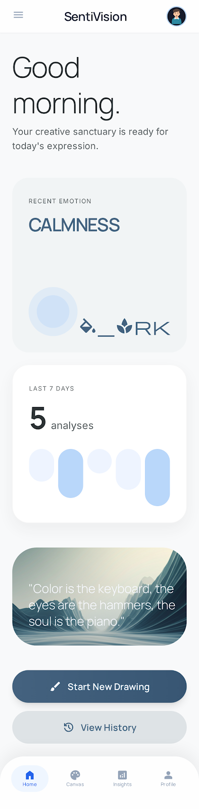
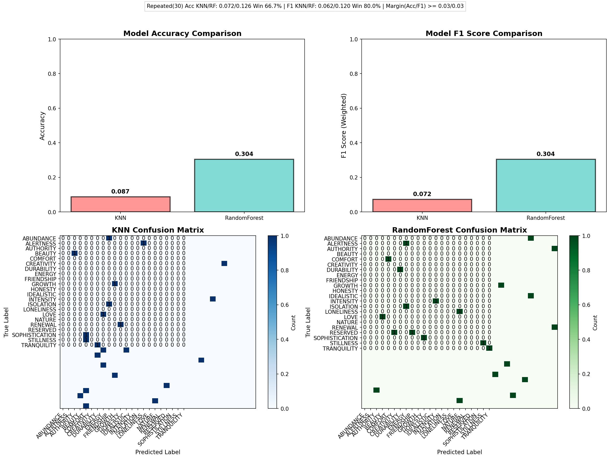

PRODUCT · iPAD · ON-DEVICE ANALYSIS

# SentiVision

## 색으로 읽고, 작품으로 남기는 감정 전시

SentiVision은 사용자가 iPad에서 자유롭게 그림을 그리고, 작품의 색을 바탕으로 감정의 결을 해석해 전시 카드로 보관하는 감성 컴퓨팅 프로젝트입니다.

**역할** 제품 기획 · iPad 앱 · 분석 프로토타입 · 데이터 검증 · DevOps 
**현재 단계** iPad 기능 프로토타입 
**저장소** github.com/acertainromance401/SentiVision 
**최종 검증** 2026-09-02

# 01. 프로젝트 한눈에 보기

## 말로 설명하기 어려운 감정을 드로잉의 흐름 안에서 돌아본다

텍스트나 음성 기반 감정 기록은 사용자가 먼저 감정을 언어로 정리해야 합니다. SentiVision은 그 부담을 줄이기 위해 **그림 그리기 → 색상 분석 → 전시형 해석 → 기록**을 하나의 흐름으로 설계했습니다.

| 항목 | 내용 |
|---|---|
| 제품 | iPad 우선 프리미엄 감정 전시 앱 |
| 핵심 사용자 | 창작 과정에서 감정과 색의 관계를 기록하고 싶은 개인 창작자 |
| 핵심 경험 | PencilKit 드로잉, 온디바이스 색상 분석, 감정 전시, 3D 분포, 로컬 아카이브 |
| 표현 원칙 | 의료 진단이나 단정이 아닌, 작품 해설과 같은 성찰형 표현 |
| 제품 전략 | 제작은 유료 iPad 앱, 후속 감상 경험은 무료 iPhone 동반 앱으로 분리 |
| 개인정보 방향 | 현재 분석과 기록을 기기 안에서 처리하는 온디바이스 우선 구조 |

**프로젝트 질문** 
색상-감정 데이터 연구를 실제 사용 가능한 iPad 경험으로 연결하면서도, 분석 결과를 정답처럼 단정하지 않으려면 어떻게 설계해야 하는가?

## 담당 범위

- PRD, 사용자 여정, 화면 흐름, WBS와 구현 우선순위 정리
- SwiftUI/PencilKit/SceneKit 기반 iPad 데모 구현
- Swift 온디바이스 색상·감정 분석과 로컬 아카이브 연결
- Python KNN/RandomForest 비교 및 데이터 보정 파이프라인 운영
- Node API, 테스트, 관측성, 기능 플래그, A/B, Canary와 CI/CD 자산 구축

# 02. 제품 경험

## 드로잉을 중심에 둔 일곱 단계

1. **개인 기준 설정**: 프로필명, 기준 감정, 기준 색상, 체감 강도를 저장합니다.
2. **자유 드로잉**: PencilKit 캔버스에서 색과 펜 굵기를 골라 그림을 그립니다.
3. **로컬 분석**: 캔버스의 전경 픽셀을 추출하고 최대 3개의 대표색을 계산합니다.
4. **감정 매핑**: 번들 CSV의 색상-감정 표본과 비교해 대표 감정과 점수를 만듭니다.
5. **감정 패밀리**: 개별 감정을 고요, 활력, 신비, 권위, 긴장, 연결, 온기, 회복, 집중, 그늘의 10개 결로 집계합니다.
6. **전시형 결과**: 해석문, 신뢰도, 대표색, 점수와 3D RGB 분포를 함께 보여줍니다.
7. **로컬 아카이브**: 결과를 전시 카드로 저장하고 다시 열람합니다.

{.product-shot}

제품 시안. 현재 데모는 별도 홈 대신 프로필 배너와 Analysis · Canvas · Archive 탭을 사용합니다.

# 03. 구현 구조

## 하나의 제품, 세 개의 목적별 트랙

| 트랙 | 현재 역할 | 핵심 기술 | 상태 |
|---|---|---|---|
| iPad 앱 | 실제 사용자 경험과 주 분석 경로 | SwiftUI, PencilKit, SceneKit, UIKit | 기능 프로토타입 |
| Node API | 배포, 관측성, 계약 실험 | Node.js HTTP, Jest, Prometheus | 독립 프로토타입 |
| Python | 모델·데이터·추출 방식 검증 | OpenCV, scikit-learn, pandas, matplotlib | 연구/회귀 트랙 |

**iPad 제품 경로** 
PencilKit 드로잉 → 전경 픽셀 추출 → K-means 대표색 → 최근접 감정 표본 → 감정 패밀리 집계 → 결과 전시 → UserDefaults 아카이브

**Python 검증 경로** 
입력 이미지 → Saliency → K-means → KNN/RandomForest 비교 → 시각화 → 사용자 정정 → CSV 버전 관리

**Node 운영 경로** 
팔레트 JSON → warmth/saturation/brightness 휴리스틱 → 감정 응답 → 구조화 로그/Prometheus 메트릭

## 왜 분리했는가

초기 문서는 서버 분석을 전제로 했지만 iPad 데모를 구현하면서 즉각적인 반응, 오프라인 동작, 개인정보 최소 전송이 더 중요한 제품 가치라고 판단했습니다. 따라서 앱의 주 경로는 온디바이스로 전환하고, Node API는 배포·관측성 실험, Python은 모델 검증에 집중시켰습니다.

이 분리는 아직 최종 아키텍처 결정이 아닙니다. 다음 단계에서 개인화 학습과 동기화 요구를 검증한 후 온디바이스 유지, 모델 번들 교체, 원격 추론 중 하나를 선택할 수 있도록 문서에 경계를 명시했습니다.

# 04. iPad 구현

## 코드로 연결된 핵심 기능

### 첫 실행과 개인 기준

`InitialSetupView`가 프로필명, 기준 감정, 기준 색상, 체감 강도를 받고 `AppStorage`에 저장합니다. 현재 기준 감정은 결과 비교 문장에 사용되며, 체감 강도의 모델 가중치 반영은 후속 범위입니다.

### PencilKit 캔버스

`DrawingCanvasView`는 `PKCanvasView`를 SwiftUI에 연결합니다. 펜·벡터 지우개, 기본 색상 팔레트, 2~24pt 굵기, 전체 지우기를 제공하며 드로잉 변경을 `PKDrawing`으로 동기화합니다.

### 온디바이스 분석

`LocalEmotionAnalysisService`는 드로잉 이미지를 렌더링한 뒤 투명·배경 픽셀을 제외하고 최대 3개의 대표색을 K-means로 찾습니다. 각 중심색을 번들 표본과 RGB 거리로 비교하고, 픽셀 수와 예측 신뢰도로 감정 점수를 집계합니다.

### 감정 분포와 아카이브

`EmotionDistributionSceneView`는 최대 120개 표본을 SceneKit RGB 공간에 점으로 렌더링합니다. `EmotionArchiveStore`는 분석 결과를 JSON으로 인코딩해 `UserDefaults`에 저장하며, 사용자는 카드 목록에서 과거 결과를 선택해 다시 볼 수 있습니다.

| 구현 파일 | 책임 |
|---|---|
| `CanvasRootView.swift` | 탭, 프로필, 캔버스 제어, 분석과 저장 흐름 |
| `DrawingCanvasView.swift` | PencilKit 브리지 |
| `LocalEmotionAnalysisService.swift` | 대표색·감정·패밀리 분석 |
| `EmotionDistributionSceneView.swift` | 결과 카드와 3D RGB 분포 |
| `EmotionArchiveView.swift` | 로컬 전시 카드 목록과 재열람 |

# 05. 데이터와 모델 검증

## 제품 코드와 연구 코드를 분리해 비교 가능성을 유지했다

원본 기준선은 `base_model/`, 개선·검증 코드는 `test/`에 분리했습니다. 보강 데이터셋은 대표 RGB 주변의 작은 변형만 추가해 감정 간 경계가 지나치게 흐려지는 문제를 줄였습니다.

| 검증 항목 | 구현 |
|---|---|
| 이미지 영역 추출 | Laplacian Saliency와 그림 중심 추출 방식 비교 |
| 대표색 | K-means, 기본 3개 중심색 |
| 감정 모델 | KNN 기준선과 RandomForest 비교 |
| 평가 | 고정 검증 인덱스, Accuracy, F1, 혼동행렬, 반복 분할 |
| 데이터 안전장치 | 중복·RGB 충돌 검사, 수정 전 CSV 백업, 업데이트 이력 |
| 시각화 | RGB 3D 분포, Saliency, 대표색 감정, 성능 대시보드 |

{.dashboard}

저장소에 보존된 모델 비교 대시보드. 수치는 데이터·분할 조건에 종속되므로 제품 정확도 주장보다 모델 선택과 회귀 확인의 근거로 사용합니다.

# 06. 엔지니어링 품질

## 기능 구현 밖의 운영 가능성도 함께 검증했다

### 테스트

- Jest: 팔레트 파싱, 휴리스틱 감정 분석, API health/analyze/metrics, 기능 플래그, A/B 할당
- Playwright: 정적 프런트 프로토타입 렌더링
- Python: smoke test, 고정 검증셋 기반 모델 비교와 분석 스크립트
- iPad: Xcode 빌드와 실기기 중심 수동 흐름 검증

### 배포와 관측성

- Docker 이미지와 Docker Compose 기반 Node API · Prometheus · Grafana 구성
- `/health`, `/metrics`, 구조화 요청 로그
- GitHub Actions 기반 테스트, 보안 스캔, Docker, Pages, AWS ECS 배포 정의
- DORA 지표 수집, Canary 단계·오류율·지연 기준과 롤백 시뮬레이터

### 실험 기반

- 사용자 ID 해시 기반의 안정적인 A/B variant 할당
- 기능별 퍼센티지 롤아웃과 대상 사용자 override
- NDJSON 이벤트 기록과 2주 A/B 분석 자산

**중요한 경계** 
CI/CD와 AWS 정의가 존재한다는 것은 운영 배포 완료를 뜻하지 않습니다. 현재 포트폴리오는 코드와 설정으로 검증 가능한 준비 상태를 설명하며, 실제 사용자 출시와 운영 KPI는 후속 단계입니다.

# 07. 진행 과정과 의사결정

## Baseline에서 제품 경험까지

| 단계 | 진행 내용 | 결과 |
|---|---|---|
| 1. 문제·데이터 정의 | 색상-감정 CSV와 Python 기준선 정리 | 분석 가능성 및 데이터 이슈 확인 |
| 2. 모델 비교 | KNN/RandomForest, 고정 검증셋, 시각화 | 모델 변경을 수치와 산출물로 비교 |
| 3. 제품 설계 | PRD, 사용자 여정, 와이어프레임, WBS | 전시형 해석과 iPad 우선 방향 확정 |
| 4. 운영 프로토타입 | Node API, 테스트, Docker, 메트릭, 실험 | 배포·관측·롤백 요구 검증 |
| 5. iPad 구현 | 온보딩, 캔버스, 로컬 분석, 3D 분포, 아카이브 | 핵심 사용자 흐름을 기기 안에서 연결 |
| 6. 감정 패밀리 | 10개 패밀리 데이터와 결과 집계 | 개별 라벨을 더 읽기 쉬운 감정 결로 구조화 |
| 7. 문서 재정렬 | 앱·API·Python의 역할과 상태 최신화 | 구현과 계획의 불일치 제거 |

## 배운 점

- 연구용 정확도와 제품의 해석 품질은 같은 지표가 아닙니다. 결과 문장, 불확실성 표현, 사용자 정정 경로가 함께 설계되어야 합니다.
- 서버 우선 설계가 항상 제품에 최적인 것은 아닙니다. iPad에서는 지연, 오프라인, 개인정보 요구 때문에 온디바이스 경로가 더 자연스러웠습니다.
- 감정 라벨 수가 많을수록 UI 이해도가 자동으로 높아지지 않습니다. 감정 패밀리는 세밀한 모델 출력과 읽기 쉬운 제품 언어 사이의 번역 계층입니다.
- 문서는 목표와 현재 상태를 분리해야 합니다. 요구사항을 지우지 않으면서 구현·프로토타입·백로그를 명시하는 방식으로 정리했습니다.

# 08. 현재 상태와 다음 단계

## 구현 상태

| 구분 | 범위 |
|---|---|
| 구현 | iPad 온보딩, PencilKit 캔버스, 로컬 대표색·감정 분석, 감정 패밀리, 결과 전시, 3D RGB 분포, 로컬 아카이브 |
| 프로토타입 | Node 팔레트 분석 API와 관측성, Python 모델·데이터 검증, 실험·배포 자동화 자산 |
| 백로그 | 감정 수정·메모, 개인 분포 학습 반영, 고급 색상 입력, 작품 이미지 아카이브, 원격 동기화·인증, iPhone 감상 앱 |

## 우선순위

1. **개인화 루프 완성**: 정정 감정과 메모를 저장하고 개인 분포에 반영합니다.
2. **창작 도구 확장**: 색상 휠, HEX/RGB, 스포이트, 재사용 팔레트를 추가합니다.
3. **앱 품질 자동화**: Swift 단위 테스트와 실기기 회귀 체크리스트를 구축합니다.
4. **분석 경계 결정**: 온디바이스 유지, 교체 가능한 모델 번들, 원격 추론의 비용과 개인정보를 비교합니다.
5. **감상 앱 검증**: 유료 iPad 경험이 안정된 뒤 무료 iPhone 동반 앱의 전환 효과를 검증합니다.

## SentiVision은 분석 모델만 만든 프로젝트가 아닙니다.

색상 데이터 연구를 iPad의 창작 경험, 전시형 결과 언어, 로컬 기록, 운영 검증 체계로 연결하며 **아이디어가 실제 제품 흐름이 되는 과정 전체**를 다뤘습니다.

**Repository** 
https://github.com/acertainromance401/SentiVision

