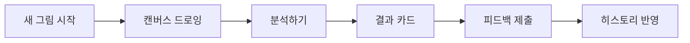
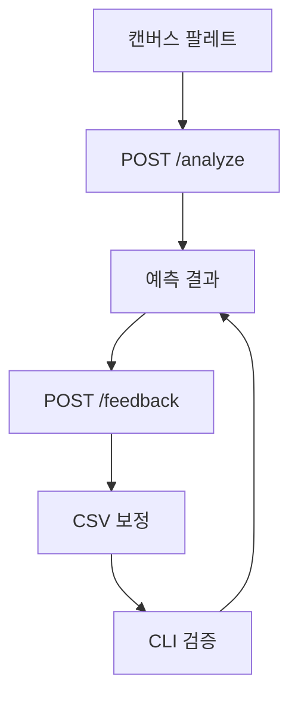

# 사용자 여정 시나리오: SentiVision

작성일: 2026-03-20  
문서 버전: v1.3

## 1. 문서 목적
이 문서는 PRD(v1.0)의 핵심 시나리오를 기준으로 개인 창작 사용자의 앱 경험과 운영 검증 흐름을 정의한다.

## 2. 사용자 페르소나
- 이름: 민서 (가상 사용자)
- 유형: 개인 창작 사용자
- 목표:
  - 현재 감정을 시각적으로 확인하고 기록
  - 색 조합의 정서 톤 점검
  - 예측 결과를 정정해 품질 개선에 참여

## 3. 핵심 사용자 여정 (앱)

### 단계 1. 앱 진입 및 목표 설정
- 사용자 행동: 홈에서 새 그림 시작
- 시스템 반응: 최근 감정과 분석 요약 제공

### 단계 2. 감정 표현 드로잉
- 사용자 행동: 캔버스에서 2~4가지 대표 색상으로 그림 작성
- 시스템 반응: 선택 색상과 추출 팔레트를 실시간 표시

### 단계 3. 분석 요청
- 사용자 행동: 분석하기 버튼 탭
- 시스템 반응: 팔레트(RGB, weight)를 API로 전송
- 로딩 UX: 색상 추출 중 -> 감정 점수 계산 중

### 단계 4. 결과 해석
- 사용자 행동: 예측 감정과 상위 점수 분포 확인
- 시스템 반응: 대표 스와치와 결과 카드 제공

### 단계 5. 피드백 및 기록
- 사용자 행동: 결과가 다르면 감정 수정, 메모(선택) 입력
- 시스템 반응: 피드백 저장 완료 안내 및 히스토리 반영

### 단계 6. 재방문 및 인사이트 확인
- 사용자 행동: 기록 화면에서 예측과 수정 로그 비교
- 시스템 반응: 감정-색 패턴 요약 제공

## 4. 운영 검증 여정 (CLI 유지)

### 단계 1. 실행
- 운영자 행동: `python test/main_.py` 실행
- 시스템 반응: CSV 로드, KNN 학습, 정확도 출력

### 단계 2. 이미지 분석
- 운영자 행동: 테스트 이미지 경로 입력
- 시스템 반응: 현저성 추출, KMeans, 감정 예측

### 단계 3. 품질 확인
- 운영자 행동: PNG 산출물과 콘솔 예측 확인
- 시스템 반응: `test/outputs/` 파일 생성

### 단계 4. 데이터 반영
- 운영자 행동: 정정 감정 입력
- 시스템 반응: CSV 업데이트 및 중복 제거

## 5. 대표 시나리오 (Happy Path)
1. 사용자는 새 그림 시작 후 파란색과 초록색 중심으로 드로잉한다.
2. 분석하기를 누르면 CALMNESS 계열 결과가 표시된다.
3. 사용자는 TRANQUILITY로 수정해 피드백을 제출한다.
4. 시스템은 저장 완료를 보여주고 히스토리에 반영한다.

## 6. 예외 시나리오
- E1. 분석 요청 실패: 네트워크/API 오류 시 재시도 버튼 제공
- E2. 입력 유효성 실패: 비정상 팔레트(weight 음수 등) 오류 안내
- E3. 피드백 저장 실패: 임시 보관 후 재전송 옵션 제공
- E4. CLI 저장 실패: CSV 권한 오류 메시지 출력 및 기존 데이터 유지

## 7. KPI 연결
- 분석 완료율: 분석 시작 대비 결과 화면 도달 비율
- 피드백 제출률: 결과 확인 대비 피드백 제출 비율
- 수정 반영률: 제출된 피드백의 저장 성공 비율
- CLI 회귀 성공률: 샘플 실행 대비 정상 완료 비율

## 8. 시각자료 (Mermaid)

### 8.1 앱 사용자 여정

### 8.2 앱, API, CLI 루프

