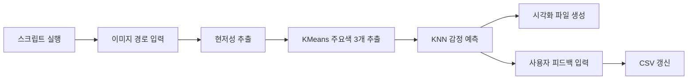
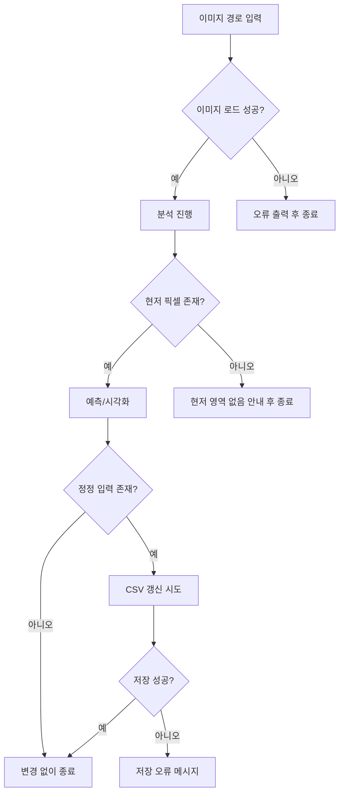

# 사용자 여정 시나리오: SentiVision

작성일: 2026-03-20  
문서 버전: v1.1

## 1. 문서 목적
이 문서는 SentiVision 사용자가 CLI 스크립트를 실행해 이미지를 분석하고, 결과를 확인한 뒤 피드백으로 데이터셋을 개선하는 전체 여정을 정의한다.

## 2. 사용자 페르소나
- 이름: 민준 (가상 사용자)
- 연령: 23세
- 유형: Python 기반 실험 프로젝트 사용자
- 특징: 이미지 색감의 감정 해석을 빠르게 확인하고 싶어함
- 목표 1: 입력 이미지에서 주요 색상과 감정 예측 결과를 확인하고 싶음
- 목표 2: 예측이 다를 경우 직접 정정해 데이터셋을 개선하고 싶음

## 3. 핵심 사용자 여정 (현재 구현 기준)

### 단계 1. 실행 준비
- 사용자 행동: 가상환경 활성화 후 `python test/main_.py` 실행
- 시스템 반응: 데이터셋 로드 및 KNN 학습 수행
- 잠재 문제: 패키지 미설치 또는 CSV 경로 오류

### 단계 2. 이미지 입력
- 사용자 행동: 콘솔에 분석할 이미지 경로 입력
- 시스템 반응: 이미지 로드 및 전처리 수행
- 잠재 문제: 잘못된 경로 입력 시 즉시 종료

### 단계 3. 색상 분석
- 사용자 행동: 스크립트 진행 대기
- 시스템 반응: 현저성 마스크 생성 후 KMeans로 주요 색상 3개 추출

### 단계 4. 감정 예측 및 결과 확인
- 사용자 행동: 콘솔 출력으로 각 주요 색상의 RGB/예측 감정 확인
- 시스템 반응: KNN 예측 결과와 함께 시각화 파일 생성

### 단계 5. 사용자 피드백 반영
- 사용자 행동: 각 색상별로 예측 감정 수락(Enter/yes/y/예) 또는 정정 감정 입력
- 시스템 반응: 정정 입력이 있는 경우 CSV에 레코드 추가 및 중복 제거

### 단계 6. 산출물 확인
- 사용자 행동: `test/outputs/` 이미지 확인
- 시스템 반응: 분석 결과 파일 3종 제공

## 4. 대표 시나리오 (Happy Path)
1. 사용자는 `python test/main_.py`를 실행한다.
2. 이미지 경로로 `test/C500x500.jpeg`를 입력한다.
3. 시스템은 주요 색상 3개와 각 감정 예측 결과를 출력한다.
4. 사용자는 1개 색상만 감정을 정정 입력하고 나머지는 수락한다.
5. 시스템은 CSV를 갱신하고 시각화 파일을 `test/outputs/`에 저장한다.

## 5. 예외 시나리오 (Edge Cases)

### E1. 이미지 경로 오류
- 상황: 파일이 없거나 읽을 수 없는 경로 입력
- 기대 동작: 오류 메시지 출력 후 종료

### E2. 현저 영역 미검출
- 상황: threshold 조건에서 유효 픽셀이 없는 경우
- 기대 동작: 안내 메시지 출력 후 종료

### E3. CSV 저장 실패
- 상황: 권한 또는 파일 잠금 문제
- 기대 동작: 예외 메시지 출력 후 기존 데이터 유지

## 6. 여정별 KPI 연결
- 실행 성공률: 스크립트 시작 대비 정상 종료 비율
- 분석 완료율: 이미지 입력 대비 결과 파일 3종 생성 비율
- 피드백 반영률: 정정 입력 대비 CSV 반영 성공 비율

## 7. 수용 기준
- 핵심 여정(실행 -> 이미지 입력 -> 분석 -> 결과 확인 -> 피드백 반영)이 중단 없이 동작한다.
- 예외 상황(잘못된 경로/현저 영역 미검출/CSV 저장 실패)에서 사용자 안내가 제공된다.
- 문서 내 경로와 산출물이 현재 저장소 구조와 일치한다.

---

## 8. 시각자료 버전 (Mermaid)

### 8.1 End-to-End 사용자 여정

### 8.2 예외 시나리오 분기

