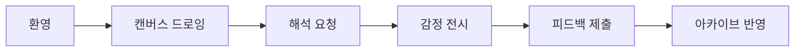
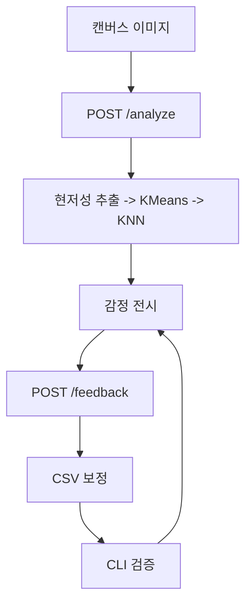

# 사용자 여정 시나리오: SentiVision

작성일: 2026-03-27  
문서 버전: v1.5

## 1. 문서 목적
이 문서는 PRD(v1.1)의 핵심 시나리오를 기준으로 개인 창작 사용자의 앱 경험과 운영 검증 흐름을 정의한다.

## 2. 사용자 페르소나
- 이름: 민서 (가상 사용자)
- 유형: 개인 창작 사용자
- 목표:
  - 마음껏 그림을 그리고 그 색을 바탕으로 감정을 해석받기
  - 색 조합의 정서 톤 점검
  - 예측 결과를 정정해 품질 개선에 참여

주요 페인포인트
- 감정을 텍스트/음성으로 표현하는 과정이 번거로워 기록을 지속하기 어렵다.
- 창작물의 색감이 전달하는 정서 톤을 즉시 확인하기 어렵다.
- 결과를 누적 비교해 개인 패턴을 파악하기 어렵다.
- 허술한 앱보다 완성도 높은 프리미엄 경험을 기대한다.

### 2.1 여정 설계 원칙
- 저마찰 입력: 드로잉 흐름을 끊지 않고 해석까지 연결한다.
- 전시형 결과: 결과를 예측값이 아니라 해설문처럼 읽게 한다.
- 닫힌 루프: 피드백 제출이 아카이브와 품질 개선으로 이어지도록 설계한다.
- 개인화 진입: 초기 사용자는 감정-색상 선택형 온보딩으로 자신의 기준을 먼저 맞춘다.

### 2.2 앱 역할 분리
| 앱 | 역할 | 과금 |
|---|---|---|
| iPad 제작 앱 | 그림을 그리고, 분석을 요청하고, 전시 카드로 저장하는 핵심 경험 | 유료 |
| iPhone 감상 앱 | 작품과 감정 전시를 감상만 하는 동반 경험 | 무료 |
| 공용 분석/아카이브 | 색상 분석, 피드백 저장, 기록 보관 | 공통 |

이 여정은 iPhone 감상 앱에서 작품을 먼저 접한 사용자가, 더 넓은 입력 공간과 제작 기능이 필요한 경우 iPad 제작 앱으로 자연스럽게 넘어가도록 설계한다.

## 3. 핵심 사용자 여정 (앱)

### 단계 0. 개인 프로필 생성
- 사용자 행동: 첫 실행 시 이름, 기준 색상, 기준 감정을 고르고 체감 조절 수준을 선택한다.
- 시스템 반응: 개인화 프로필을 저장하고 이후 분석 결과의 가중치와 해석 표현에 반영한다.
- 시스템 반응: 사용자의 수정 이력과 선택 색상은 개인별 색상-감정 분포도에 누적된다.

### 단계 1. 환영
- 사용자 행동: 앱에 진입해 오늘의 감정 톤을 바라본다.
- 시스템 반응: 최근 감정, 최근 7일 분석 수, 아카이브 진입점 제공

### 단계 2. 감정 표현 드로잉
- 사용자 행동: 색상 휠, 헥스 코드 입력, RGB 슬라이더, 프리셋, 스포이트로 색상을 자유롭게 선택해 그림 작성
- 시스템 반응: 선택 색상과 추출 팔레트를 실시간 표시

### 단계 3. 해석 요청
- 사용자 행동: 분석하기 버튼 탭
- 시스템 반응: 그린 이미지를 API로 전송하고, 서버는 현저성 추출 -> KMeans -> KNN 순서로 분석
- 로딩 UX: 색상 추출 중 -> 감정 점수 계산 중

### 단계 4. 감정 전시
- 사용자 행동: 감정 제목, 해석 문장, 키워드, 점수 분포 확인
- 시스템 반응: 대표 스와치와 전시형 결과 카드 제공

### 단계 5. 피드백 및 기록
- 사용자 행동: 결과가 다르면 감정 수정, 메모(선택) 입력
- 시스템 반응: 피드백 저장 완료 안내 및 히스토리 반영
- 시스템 반응: 수정된 감정과 선택 색상은 개인 분포 그래프와 데이터 표에 반영된다.

### 단계 6. 개인화 기준 선택(후속 온보딩)
- 사용자 행동: 희망/차분함/신비/우울 같은 감정 단어를 보고 어울리는 색을 선택
- 시스템 반응: 사용자 개인의 색-감정 기준을 저장하고, 이후 분석의 해석 강도에 반영

### 단계 7. 아카이브와 인사이트 확인
- 사용자 행동: 아카이브 화면에서 감정 제목, 팔레트, 메모를 다시 본다.
- 시스템 반응: 감정-색 패턴 요약 제공
- 시스템 반응: 개인 분포 그래프를 중심으로 보여주어 사용자의 기준이 어떻게 바뀌었는지 확인한다.

## 4. 운영 검증 여정 (CLI 유지)

### 단계 1. 실행
- 운영자 행동: `python test/main_.py` 또는 `python test/run_all_analysis.py` 실행
- 시스템 반응: CSV 로드, KNN 학습, 정확도 출력 또는 비교 스크립트까지 순차 실행

### 단계 2. 이미지 분석
- 운영자 행동: 테스트 이미지 경로 입력
- 시스템 반응: 현저성 추출, KMeans, 감정 예측

### 단계 3. 품질 확인
- 운영자 행동: 타임스탬프 기반 PNG 산출물과 콘솔 예측/비교 리포트 확인
- 시스템 반응: `test/outputs/main_*.png`, `test/outputs/comparison_*.png` 파일 생성

### 단계 4. 데이터 반영
- 운영자 행동: 정정 감정 입력
- 시스템 반응: CSV 업데이트 및 중복 제거

## 5. 대표 시나리오 (Happy Path)
1. 사용자는 넓은 iPad 캔버스에서 파란색과 초록색 중심으로 자유롭게 드로잉한다.
2. 분석하기를 누르면 CALMNESS 계열 해석과 색상 전시가 표시된다.
3. 사용자는 TRANQUILITY로 수정해 피드백을 제출한다.
4. 시스템은 저장 완료를 보여주고 아카이브에 반영한다.

## 6. 예외 시나리오
- E1. 분석 요청 실패: 네트워크/API 오류 시 재시도 버튼 제공
- E2. 입력 유효성 실패: 비정상 팔레트(weight 음수 등) 오류 안내
- E3. 피드백 저장 실패: 임시 보관 후 재전송 옵션 제공
- E4. CLI 저장 실패: CSV 권한 오류 메시지 출력 및 기존 데이터 유지

## 7. KPI 연결
- 분석 완료율: 분석 시작 대비 결과 화면 도달 비율
- 피드백 제출률: 결과 확인 대비 피드백 제출 비율
- 수정 반영률: 제출된 피드백의 저장 성공 비율
- CLI 회귀 성공률: 샘플 실행 대비 정상 완료 비율

## 8. 시각자료 (Mermaid)

### 8.1 앱 사용자 여정

### 8.2 앱, API, CLI 루프

