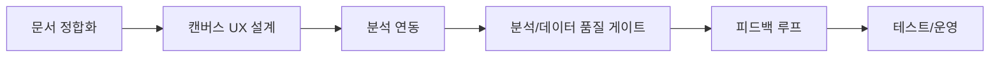

# WBS: SentiVision

최초 작성일: 2026-03-27
최종 검증일: 2026-09-02
문서 버전: v1.7

## 1. 개요
본 WBS는 PRD(v1.1) 의도에 맞춰 iPad 우선 프리미엄 감정 해석 앱 개발을 중심으로 작업을 분해한다. 현재 CLI 파이프라인은 검증 트랙으로 병행 유지한다.

### 현재 진행 스냅샷

| 트랙 | 상태 | 완료 범위 | 다음 작업 |
|---|---|---|---|
| iPad 앱 | 프로토타입 완성 | 온보딩, 캔버스, 로컬 분석, 결과, 3D 분포, 로컬 아카이브 | 피드백·메모, 개인 학습, 고급 색상 선택 |
| Node API | 운영 프로토타입 | health, metrics, 팔레트 휴리스틱 analyze | 앱 계약, 인증, 영속 저장 또는 온디바이스 유지 결정 |
| Python | 검증 트랙 운영 | Saliency/K-means/KNN, RF 비교, 시각화 | 재현성·품질 리포트 자동화 |
| iPhone | 백로그 | 역할과 화면 방향 정의 | iPad 제품 검증 후 착수 |

## 2. WBS 구조

### 1. 프로젝트 관리
1.1 마일스톤/우선순위 관리  
1.2 주간 진행 점검  
1.3 리스크/이슈 관리

산출물
- 주간 계획/회고
- 리스크 로그

---

### 2. 요구사항/문서 정합화
2.1 PRD 기반 용어/범위 통일  
2.2 User Journey/Wireframe/WBS 동기화  
2.3 데이터셋 프로파일 업데이트  
2.4 문제 정의 반영 점검 (현황/페인포인트/대안 한계/해결 필요성)

산출물
- `Project_Descriptions` 문서 세트

---

### 3. 캔버스 UX 설계
3.1 초기 세팅/개인 프로필 화면 설계  
3.2 환영/새 작품 시작 화면 설계  
3.3 캔버스 입력/팔레트 표시 UX 설계  
3.4 색상 선택 다양화 UX 설계 (색상휠/HEX/RGB/프리셋/스포이트)  
3.5 감정 전시/아카이브 화면 설계
3.6 iPhone 감상 앱 화면 분리 계획 수립

산출물
- 와이어프레임
- 화면 흐름도
- ScreenFlow 문서

---

### 4. 분석 연동/계약 설계
4.1 분석 계약 스키마 설계  
4.2 피드백 계약 스키마 설계  
4.3 상태 확인/검증 규칙 정리  
4.4 입력 유효성 검증 로직 구현

산출물
- API 명세
- Node.js API 프로토타입
- 온디바이스 분석 계약과 향후 원격 전환 명세

---

### 5. 분석 엔진/데이터 파이프라인
5.1 KNN 학습/예측 로직 유지  
5.2 현저성 + KMeans 주요색 추출 유지  
5.3 그림 중심 `paint_region` 연구 로직 비교/검증  
5.4 데이터 정규화/오탈자 매핑 정책 적용  
5.5 결측/중복 처리 정책 반영  
5.6 모델 비교 파이프라인(KNN vs RandomForest) 운영

산출물
- `test/main_.py`
- `test/test_model_comparison.py`
- `test/research_compare_extraction.py`
- `test/run_all_analysis.py`
- 데이터 품질 리포트

---

### 6. 피드백 루프
6.1 앱 피드백 수집/저장  
6.2 CSV 반영 규칙 적용  
6.3 사용자 개인화 가중치/감정-색 매핑 실험 계획  
6.4 품질 개선 로그 기록

산출물
- `test/color_emotion_labeled_augmented.csv`
- 피드백 처리 로그

---

### 7. 시각화/리포팅
7.1 RGB 3D 분포 산출  
7.2 Saliency 맵 산출  
7.3 주요 색상-감정 산출  
7.4 성능 비교 대시보드 산출

산출물
- `test/outputs/main_YYYYMMDD_HHMMSS_rgb_3d_distribution.png`
- `test/outputs/main_YYYYMMDD_HHMMSS_saliency_maps.png`
- `test/outputs/main_YYYYMMDD_HHMMSS_dominant_color_emotions.png`
- `test/outputs/comparison_YYYYMMDD_HHMMSS_performance_dashboard.png`
- `test/outputs/comparison_YYYYMMDD_HHMMSS_knn_rf_color_pair.png`

---

### 8. 테스트/검증
8.1 Node API 테스트(Jest)
8.2 앱 사용자 시나리오/Swift 테스트
8.3 CLI 회귀 테스트  
8.4 고정 검증 인덱스 기반 모델 비교 테스트

산출물
- 테스트 리포트

---

### 9. 운영/배포 준비
9.1 KPI 수집 체계 정리  
9.2 DORA 워크플로 연계  
9.3 배포 체크리스트 정리
9.4 iPhone 무료 감상 앱 전환 구조 정리

산출물
- 운영 지표 문서
- 배포 체크리스트

## 3. 후속 우선순위
1. 감정 수정·메모와 개인 분포 반영
2. 고급 색상 도구와 작품 이미지 아카이브
3. iPad 앱 자동 테스트와 실기기 회귀 체크리스트
4. 온디바이스/원격 분석 계약 결정과 보안·저장 설계
5. iPhone 감상 앱 검증

## 4. 시각화: 작업 흐름

