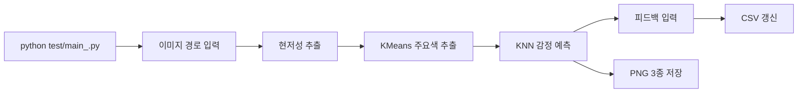
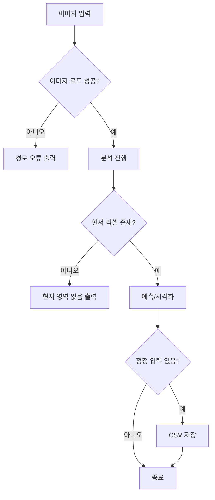

# Wireframe: SentiVision (CLI 현재 버전)

작성일: 2026-03-20  
문서 버전: v1.1

## 1. 인터랙션 구조 개요

핵심 플로우
1. 스크립트 실행
2. 이미지 경로 입력
3. 분석 진행
4. 결과 확인
5. 피드백 입력
6. 파일 출력 확인

---

## 2. CLI 와이어플로우 (Low-Fidelity)

### Step A. 실행

```text
$ source .venv/bin/activate
$ python test/main_.py

예측 결과: [...]
정확도: 0.xx
분석할 이미지 파일 경로를 입력하세요:
```

### Step B. 이미지 입력

```text
분석할 이미지 파일 경로를 입력하세요: test/C500x500.jpeg
```

### Step C. 분석 결과 출력

```text
[saliency] Extracted Color-Emotions:
color 1: RGB = (255, 120, 80) | 감정 예측 = ENERGY
color 2: RGB = (40, 80, 190) | 감정 예측 = CALMNESS
color 3: RGB = (120, 200, 90) | 감정 예측 = HARMONY
```

### Step D. 피드백 입력

```text
[1] 예측된 색상 RGB = (255, 120, 80) -> 예측 감정: ENERGY
이 감정이 맞습니까? (Enter/yes/y/예 = 예, 아니면 원하는 감정 입력):

[2] 예측된 색상 RGB = (40, 80, 190) -> 예측 감정: CALMNESS
이 감정이 맞습니까? (Enter/yes/y/예 = 예, 아니면 원하는 감정 입력): tranquility
```

### Step E. 종료 및 산출물

```text
[plot saved] test/outputs/rgb_3d_distribution.png
[plot saved] test/outputs/saliency_maps.png
[plot saved] test/outputs/dominant_color_emotions.png

감정 데이터가 성공적으로 추가되었습니다.
```

---

## 3. 상태/예외 흐름

### E1. 이미지 로드 실패
```text
이미지를 불러올 수 없습니다. 경로를 확인하세요.
```

### E2. 현저 영역 미검출
```text
현저한 영역이 감지되지 않았습니다.
```

### E3. CSV 저장 오류
```text
CSV 저장 중 오류 발생: ...
```

---

## 4. 현재 입출력 포인트
- 입력
  - 이미지 경로(콘솔 입력)
  - 감정 피드백(콘솔 입력)
- 출력
  - 콘솔 예측 로그
  - `test/outputs/` PNG 파일 3종
  - `test/color_emotion_labeled_updated.csv` 갱신(정정 입력 시)

---

## 5. 향후 UI 와이어프레임 범위 (참고)
현재 저장소에는 앱/웹 UI 구현이 없으므로 아래는 확장 설계 범위로 유지한다.

P1
- 분석 요청 UI
- 결과 카드/차트 UI

P2
- 히스토리 조회 UI
- 필터/검색 UI

---

## 6. 시각자료 버전 (Mermaid)

### 6.1 CLI 플로우



### 6.2 예외 분기


