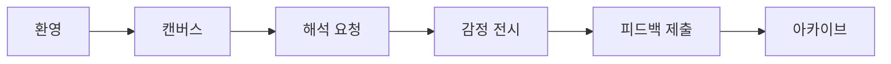
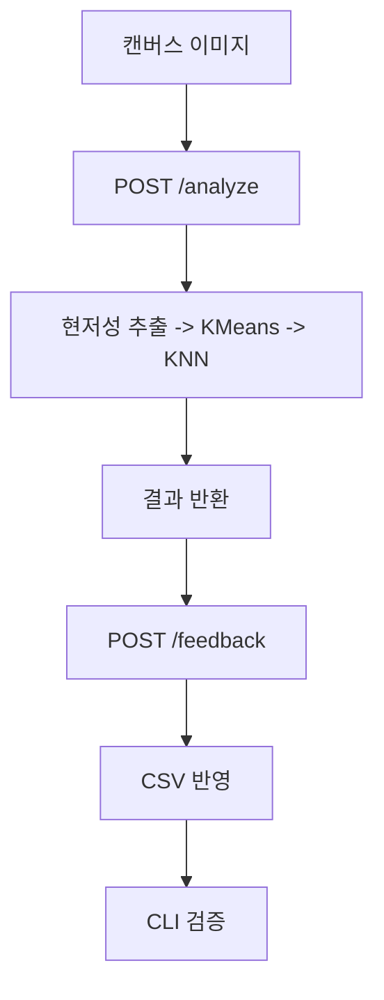

# Wireframe: SentiVision (PRD 정렬 버전)

작성일: 2026-03-27  
문서 버전: v1.5

## 1. 인터랙션 구조 개요

문제 정의 정렬 메모
- 본 와이어플로우는 "창작 중 감정 기록의 입력 부담"을 줄이기 위해 환영 -> 드로잉 -> 해석 -> 전시 -> 아카이브 흐름으로 구성한다.
- 결과 화면은 의도-결과 간극을 빠르게 확인하도록 해석 문장, 점수 분포, 대표 색상을 동시 제공한다.
- 아카이브 화면은 단발 분석 문제를 줄이기 위해 감정 제목, 팔레트, 메모를 기본 단위로 설계한다.

핵심 플로우(앱)
1. 앱 진입/환영
2. 캔버스 드로잉
3. 해석 요청
4. 감정 전시
5. 피드백 제출
6. 아카이브 확인

보조 플로우(CLI 검증)
1. 스크립트 실행
2. 이미지 경로 입력
3. 예측/시각화/CSV 반영

---

## 2. 앱 와이어플로우 (Low-Fidelity)

### Screen A. 환영

```text
+------------------------------------------------+
| SentiVision                                    |
| 오늘의 감정 톤을 색으로 읽어보세요             |
|                                                |
| 최근 감정: CALMNESS                            |
| 최근 7일 분석 수: 5                            |
|                                                |
| [새 작품 시작]                                 |
| [아카이브 보기]                                |
+------------------------------------------------+
```

### Screen B. 캔버스

```text
+------------------------------------------------+
| 캔버스                                          |
| [브러시] [지우개] [색상휠] [HEX] [RGB] [스포이트] |
|                                                |
|            (드로잉 영역)                        |
|                                                |
| 선택/추출 팔레트: [#1] [#2] [#3] ...            |
| [분석하기]                                      |
+------------------------------------------------+
```

### Screen C. 분석 로딩

```text
+------------------------------------------------+
| 분석 중...                                      |
| 색상 추출 중 -> 감정 점수 계산 중               |
| [진행 인디케이터]                               |
+------------------------------------------------+
```

### Screen D. 결과

```text
+------------------------------------------------+
| 감정 전시                                       |
| 감정 제목: TRANQUILITY                          |
| 해석: 조용하지만 깊게 번지는 안정의 결         |
| 점수 분포: TRANQUILITY 0.41 / CALMNESS 0.29 ... |
| 대표 색상: [스와치1] [스와치2] [스와치3]         |
|                                                |
| [전시 저장] [감정 수정] [메모 추가]              |
+------------------------------------------------+
```

### Screen E. 피드백/저장

```text
+------------------------------------------------+
| 피드백 제출                                     |
| 예측 감정: TRANQUILITY                          |
| 실제 감정: [__________________]                 |
| 메모(선택): [__________________]                |
|                                                |
| [제출] [취소]                                   |
+------------------------------------------------+
```

### Screen F. 히스토리

```text
+------------------------------------------------+
| 아카이브                                         |
| 03/20 10:23  해석: CALMNESS -> 수정: TRANQUILITY |
| 03/19 22:10  해석: ENERGY -> 수정 없음           |
|                                                |
| [상세보기]                                      |
+------------------------------------------------+
```

---

## 3. 상태/예외 메시지

- E1. 분석 API 실패: "네트워크 상태를 확인하고 다시 시도해주세요."
- E2. 입력 검증 실패: "선택한 색상 값이 유효하지 않습니다."
- E3. 피드백 저장 실패: "피드백 저장 중 오류가 발생했습니다."
- E4. CLI CSV 저장 실패: "CSV 저장 중 오류 발생: ..."

---

## 4. CLI 와이어플로우 (운영 유지)

### Step A. 실행

```text
$ source .venv/bin/activate
$ python test/main_.py
# 또는
$ python test/run_all_analysis.py
```

### Step B. 분석/피드백

```text
분석할 이미지 파일 경로를 입력하세요: test/C500x500.jpeg
[saliency] Extracted Color-Emotions:
...
이 감정이 맞습니까? (Enter/yes/y/예 = 예, 아니면 원하는 감정 입력):
```

### Step C. 산출물

```text
✓ 이미지 저장: main_YYYYMMDD_HHMMSS_rgb_3d_distribution.png
✓ 이미지 저장: main_YYYYMMDD_HHMMSS_saliency_maps.png
✓ 이미지 저장: main_YYYYMMDD_HHMMSS_dominant_color_emotions.png
✓ 이미지 저장: comparison_YYYYMMDD_HHMMSS_performance_dashboard.png
```

---

## 5. 시각자료 (Mermaid)

### 5.1 앱 화면 흐름



### 5.2 앱, API, 데이터 루프


