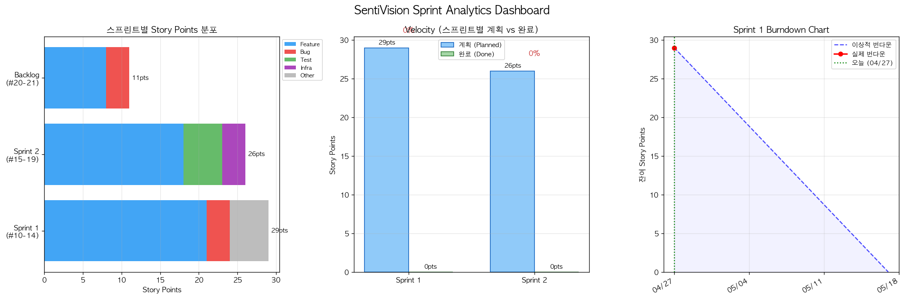

# SentiVision Sprint Analytics Report

**분석 일자:** 2026-04-27  
**Repository:** acertainromance401/SentiVision  

## 1. Cycle Time

| 이슈 | 제목 | 스프린트 | 상태 | Cycle Time(일) |
|------|------|----------|------|---------------|
| #10 | [Feature] 감정 분석 모델 파이프라인 구현 | Sprint 1 | 진행중 | 0.0 (WIP) |
| #11 | [Feature] 컬러-감정 매핑 데이터셋 전처리 파이프라인 | Sprint 1 | 진행중 | 0.0 (WIP) |
| #12 | [Feature] REST API 엔드포인트 설계 및 구현 (/analy | Sprint 1 | 진행중 | 0.0 (WIP) |
| #13 | [Feature] PDF/이미지 OCR 텍스트 추출 모듈 | Sprint 1 | 진행중 | 0.0 (WIP) |
| #14 | [Bug] 감정 분석 결과 일관성 오류 수정 | Sprint 1 | 진행중 | 0.0 (WIP) |
| #15 | [Feature] 감정 시각화 대시보드 UI 구현 | Sprint 2 | 진행중 | 0.0 (WIP) |
| #16 | [Feature] 배치 이미지 분석 기능 구현 | Sprint 2 | 진행중 | 0.0 (WIP) |
| #17 | [Test] 모델 정확도 검증 테스트 스위트 작성 | Sprint 2 | 진행중 | 0.0 (WIP) |
| #18 | [Infra] Docker Compose 프로덕션 환경 구성 | Sprint 2 | 진행중 | 0.0 (WIP) |
| #19 | [Feature] 감정 분석 결과 내보내기 (PDF 리포트) | Sprint 2 | 진행중 | 0.0 (WIP) |
| #20 | [Bug] 대용량 이미지(>10MB) 처리 시 메모리 오류 | Backlog | 진행중 | 0.0 (WIP) |
| #21 | [Feature] 사용자 피드백 수집 및 모델 재학습 루프 | Backlog | 진행중 | 0.0 (WIP) |

> 완료된 이슈 없음 — 현재 WIP Age 평균: 0.0일

## 2. Velocity

| 스프린트 | 계획 (pts) | 완료 (pts) | 완료율 | 계획 이슈 수 | 완료 이슈 수 |
|----------|-----------|-----------|--------|-------------|-------------|
| Sprint 1 | 29 | 0 | 0% | 5 | 0 |
| Sprint 2 | 26 | 0 | 0% | 5 | 0 |

## 3. Sprint 1 Burndown

- **시작일:** 2026-04-27  
- **종료일:** 2026-05-17  
- **총 Story Points:** 29pts  
- **완료 Points:** 0pts  
- **잔여 Points:** 29pts  

| 항목 | 값 |
|------|---|
| 경과 기간 | 0/20일 (0%) |
| 완료율 | 0% |
| 상태 | ✅ 순조로운 진행 |

## 4. 차트

